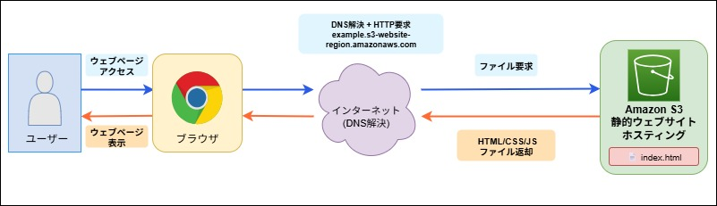
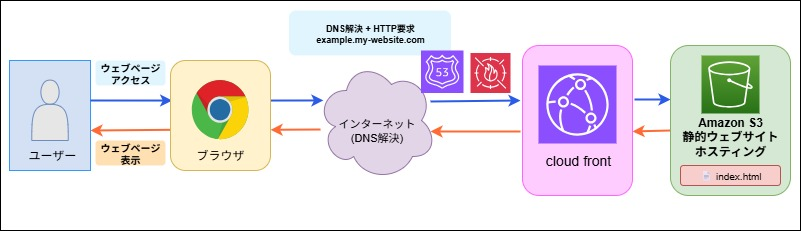
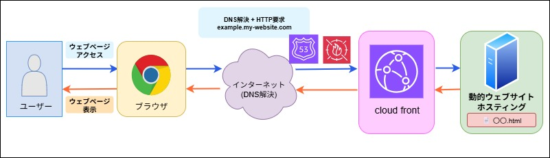
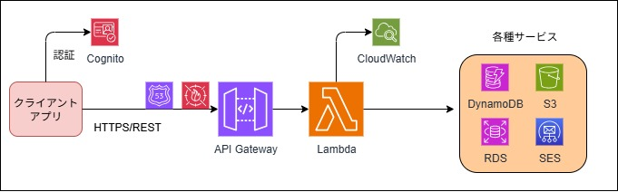

# アプリケーション開発でよくあるユースケースと定番構成

<details>
<summary>🌐 Webサイトを公開したい</summary>

## 構成パターン

<details>
<summary>Amazon S3（単体）</summary>



#### 特徴

- 最もシンプルな静的サイトホスティング。
- github pages でも無料で同様のことができるがレイテンシ等での制限あり。
- 用途: 学習・検証用。もしくは社内限定の簡易サイト等。
- 制限: HTTPS不可、カスタムドメイン不可、配信速度が遅い。

</details>

<details>
<summary>CloudFront + Amazon S3</summary>




#### 特徴

- 本格運用での定番パターン。HTTPS対応、高速配信、カスタムドメイン簡単。
- S3単体の制限をすべて解決、本番環境では必須レベル。

</details>

<details>
<summary>CloudFront + Webサーバー（EC2/ELB等）</summary>



#### 特徴

- 本格的な動的Webアプリケーション向け。
- Auto Scalingによる負荷分散。
- コンテナベースのアプリケーションに最適。

</details>

## まとめ

<details>
<summary>比較表</summary>

| 構成 | 用途 | 強み | 弱み | 月額コスト目安 |
|------|------|------|------|--------------|
| **Amazon S3（単体）** | 学習・検証専用 | • 設定が最も簡単<br>• 最安値<br>• すぐに始められる | • **HTTPS利用不可**<br>• **独自ドメインでHTTPS不可**<br>• 配信速度が遅い<br>• 本番環境には不適切 | $1〜5 |
| **CloudFront + Amazon S3** | 静的サイトの本番環境 | • HTTPS標準対応<br>• 世界中で高速配信<br>• カスタムドメイン簡単<br>• キャッシュによるコスト削減 | • 初期設定がやや複雑<br>• キャッシュ管理が必要<br>• 静的コンテンツのみ | $5〜20 |
| **CloudFront + Webサーバー（EC2/ELB等）** | 動的Webアプリ | • 動的コンテンツ対応<br>• 高度なルーティング<br>• Auto Scaling対応<br>• 完全なカスタマイズ性 | • 設定が最も複雑<br>• 運用負荷が高い<br>• コストが高い | $50〜200+ |

</details>

<details>
<summary>セキュリティ考慮事項</summary>


#### ⚠️ セキュリティのベストプラクティス

- S3バケットは必ずプライベートに設定
- CloudFront経由でのみアクセス許可（OAC/OAI使用）
- WAFの導入検討（DDoS対策、SQLインジェクション防止）
- 適切なCORS設定

</details>

<details>
<summary>選定フローチャート</summary>


```
スタート
↓
静的サイトか？
├─ Yes → 本番環境か？
│        ├─ Yes → S3 + CloudFront
│        └─ No → S3単体
└─ No → CloudFront + ALB/EC2/Fargate
```

</details>

</details>

---

<details>
<summary>🔌 APIを提供したい</summary>

## 構成パターン

<details>
<summary>AWS Lambda + API Gateway</summary>



#### 特徴

- **サーバーレスAPI開発の定番**。インフラ管理不要、自動スケール、従量課金
- **API Gatewayタイムアウト**: デフォルト29秒（上限緩和で延長可能）
- **コールドスタート**: 初回実行時に数秒の遅延が発生する可能性

#### 適用場面

- RESTful API、GraphQL API
- 軽量なデータ変換・集計処理
- イベント駆動型処理（S3アップロード時の画像リサイズ等）
- マイクロサービスのバックエンド

</details>

<details>
<summary>AWS Lambda URLs</summary>

#### 特徴

- **Lambda自身にHTTPSエンドポイントを発行**。API Gateway不要
- **シンプルな構成**。中間レイヤーがないため低レイテンシ
- **Lambdaタイムアウトまで実行可能**（最大15分）
- **機能制限**: API Gatewayの高度な機能（認証、レート制限等）は利用不可

#### 適用場面

- シンプルなAPI（認証・レート制限が不要）
- Webhook受信
- 長時間処理が必要な軽量API（15分以内）
- 最小構成でのプロトタイピング

</details>

<details>
<summary>Amazon ECS/Fargate</summary>

#### 特徴

- **Dockerコンテナベース**のマネージドサービス
- **Fargate**: サーバーレス版ECS（サーバー管理不要）
- **ECS（EC2起動タイプ）**: コスト重視、より細かい制御が可能

#### 適用場面

- 長時間実行が必要なAPI（機械学習推論、動画処理等）
- 既存のDockerアプリケーションの移行
- マイクロサービスアーキテクチャ
- 常時稼働が必要なアプリケーション

</details>

<details>
<summary>Amazon EC2 + Application Load Balancer (ALB)</summary>

#### 特徴

- **仮想サーバー + ロードバランサー**の従来型構成
- **フルコントロール**可能、OSレベルからの設定
- **Auto Scaling**によるスケールアウト/イン対応

#### 適用場面

- 既存のレガシーアプリケーションの移行
- 特殊なミドルウェアや設定が必要
- 高度なカスタマイズが必要なアプリケーション
- オンプレミスからのリフト&シフト

</details>

## まとめ

<details>
<summary>構成別比較表</summary>

| 構成 | 初期構築 | 運用負荷 | スケーラビリティ | コスト効率 | レスポンス速度 | 適用場面 |
|------|----------|----------|------------------|------------|--------------|----------|
| **Lambda + API Gateway** | ★★★ | ★★★ | ★★★ | ★★☆ | ★★☆ | RESTful API、認証・変換必要、**29秒以内の処理** |
| **Lambda URLs** | ★★★ | ★★★ | ★★★ | ★★★ | ★★★ | シンプルAPI、Webhook、**15分以内の処理** |
| **ECS/Fargate** | ★★☆ | ★★☆ | ★★★ | ★★☆ | ★★★ | 複雑なコンテナアプリ、長時間処理 |
| **EC2 + ALB** | ★☆☆ | ★☆☆ | ★★☆ | ★☆☆ | ★★★ | レガシー移行、フルコントロール必要 |

</details>

<details>
<summary>アーキテクチャ選択フローチャート</summary>


```text
処理時間15分以内？
├─ Yes → 認証・レート制限等が必要？
│        ├─ Yes → Lambda + API Gateway
│        └─ No → Lambda URLs
└─ No
   └─ コンテナ化済み？
      ├─ Yes → ECS/Fargate
      └─ No
         └─ 運用コスト重視？
            ├─ Yes → Lambda（処理分割を検討）
            └─ No → EC2 + ALB
```

</details>

<details>
<summary>コスト目安（月間）</summary>

```
前提: 100万リクエスト/月、平均処理時間100ms

Lambda + API Gateway:
- Lambda: 約200円（128MB）
- API Gateway: 約450円
- 合計: 約650円

Lambda URLs:
- Lambda: 約200円（128MB）
- 合計: 約200円

ECS/Fargate（常時稼働）:
- 1vCPU、2GB: 約5,000円
- ALB: 約2,500円
- 合計: 約7,500円

EC2 + ALB（常時稼働）:
- t3.small: 約2,000円
- ALB: 約2,500円
- 合計: 約4,500円
```

</details>

<details>
<summary>セキュリティベストプラクティス</summary>


#### 🔐 API セキュリティチェックリスト:
□ API認証の実装（API Key、OAuth、JWT等）
□ レート制限の設定
□ WAFの導入（SQLインジェクション、XSS対策）
□ APIログの有効化（CloudWatch、X-Ray）
□ 通信の暗号化（HTTPS必須）
□ CORSの適切な設定
□ 入力値検証の実装
□ エラーメッセージの最小化（情報漏洩防止）

</details>

<details>
<summary>パフォーマンス最適化のヒント</summary>

- Lambda: Provisioned Concurrencyでコールドスタート対策
- API Gateway: キャッシュ機能の活用
- ECS: Service Connectでサービス間通信を最適化
- 共通: X-Rayでボトルネックを特定
- 共通: CloudFrontでAPIレスポンスをキャッシュ

</details>

<details>
<summary>実装時の注意点</summary>

- **Lambda + API Gateway**: API Gatewayのタイムアウト制限（デフォルト29秒）、同時実行数制限（デフォルト1000）、VPC設定時のコールドスタート増加
- **Lambda URLs**: API Gatewayの高度な機能（認証、レート制限、リクエスト変換等）が利用不可
- **ECS/Fargate**: タスク定義のCPU/メモリ配分、ヘルスチェック設定が重要
- **EC2 + ALB**: セキュリティグループ設定、Auto Scalingポリシーの調整が必要

</details>

</details>
