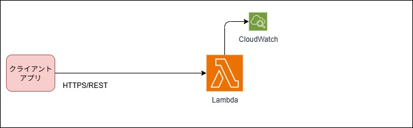
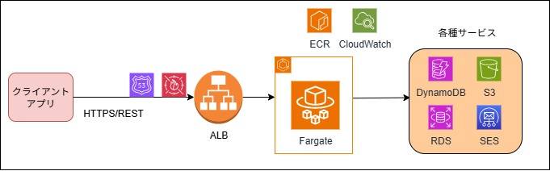
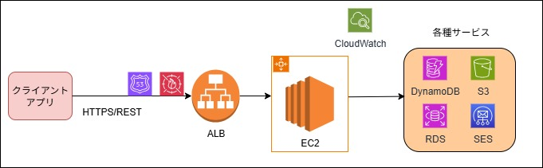

# アプリケーション開発でよくあるユースケースと定番構成

<details>
<summary>🌐 SPAサイトを公開したい</summary>

React で SPA を開発し公開する場合の定番構成パターンを紹介します。

## 構成パターン

<details>
<summary>Amazon S3（単体）</summary>


#### 特徴

- 最もシンプルな静的サイトホスティング
- React、Vue.js、Angular等のSPAをビルド後すぐにデプロイ可能
- 検証用途なら github pages は無料なのでそちらも選択肢
- 用途: 学習・検証用、社内限定の簡易サイト
- 制限: HTTPS不可、カスタムドメイン不可、配信速度が遅い

⚠️ **本番環境では使用禁止**: HTTPSが利用できないため、モダンブラウザの多くの機能が制限される

</details>

<details>
<summary>CloudFront + Amazon S3</summary>


#### 特徴

- **SPA本番環境での定番パターン**。HTTPS対応、高速配信、カスタムドメイン簡単
- SPAのルーティング（History API）に対応可能

#### 重要設定

```json
// SPA履歴モード対応（CloudFront Error Pages）
{
  "ErrorCode": 404,
  "ResponsePagePath": "/index.html",
  "ResponseCode": "200"
}
```

**セキュリティ**: S3バケットはプライベート設定 + OAC（Origin Access Control）使用

</details>

<details>
<summary>CloudFront + Webサーバー（EC2/ECS等）</summary>


#### 特徴

- **SSR（Server-Side Rendering）対応SPA向け**
- Next.js、Nuxt.js等のフルスタックフレームワーク対応

#### 適用場面

- **SEO要件**: 検索エンジン最適化が必要な大規模サイト
- **動的メタタグ生成**: ソーシャルメディア共有時のOGP生成等
- **リアルタイム機能**: WebSocketサーバーを同一インフラで管理したい
- **初期表示速度重視**: First Contentful Paint (FCP) の高速化が必要
- **低スペック端末対応**: 古いスマートフォンでの動作保証
- **アクセシビリティ要件**: スクリーンリーダー等の支援技術との互換性
- **セキュリティ要件**: 機密データをクライアントサイドで露出させたくない
- **JavaScript無効環境**: プログレッシブエンハンスメントが必要

</details>

## まとめ

<details>
<summary>比較表</summary>

| 構成 | 用途 | 強み | 弱み |
|------|------|------|------|
| **Amazon S3（単体）** | 学習・開発専用 | • 設定が最も簡単<br>• **最安値（従量課金）**<br>• すぐに始められる | • **HTTPS利用不可**<br>• **SPA履歴モード未対応**<br>• 配信速度が遅い<br>• 本番環境不適切 |
| **CloudFront + Amazon S3** | 静的SPA本番環境 | • HTTPS標準対応<br>• 世界中で高速配信<br>• SPA履歴モード対応<br>• **低コスト（配信量に比例）** | • 初期設定やや複雑<br>• キャッシュ管理必要<br>• 静的コンテンツのみ |
| **CloudFront + Webサーバー（EC2/ECS等）** | SSR対応SPA | • SSR対応<br>• SEO最適化<br>• 動的メタタグ<br>• WebSocket対応 | • 設定が最も複雑<br>• 運用負荷が高い<br>• **高コスト（常時稼働）** |

</details>

</details>

---

<details>
<summary>🔌 APIを提供したい</summary>

SPA + APIサーバーの構成を前提に、代表的なAPI構成パターンを紹介します。

## 構成パターン

<details>
<summary>AWS Lambda + API Gateway</summary>


#### 特徴

- **サーバーレスAPI開発の定番**。インフラ管理不要、自動スケール、従量課金
- **API Gatewayタイムアウト値制約**: デフォルト29秒（上限緩和で延長可能※）
- **Lambdaのコールドスタート**: 初回実行時に数秒の遅延が発生する可能性

⚠️ **API Gatewayのタイムアウト値**: [こちら](https://aws.amazon.com/jp/about-aws/whats-new/2024/06/amazon-api-gateway-integration-timeout-limit-29-seconds/) より最近延長可能になりました。  
実際に延長申請した場合、120秒までは制約なしであげれましたが、180秒へはレイテンシーに制約がかかるとの条件が提示されました。

#### 適用場面

- RESTful API、GraphQL API
- 軽量なデータ変換・集計処理
- イベント駆動型処理（S3アップロード時の画像リサイズ等）
- マイクロサービスのバックエンド

</details>

<details>
<summary>AWS Lambda URLs</summary>



#### 特徴

- **Lambda自身にHTTPSエンドポイントを発行**。API Gateway不要
- **シンプルな構成**。中間レイヤーがないため低レイテンシ
- **Lambdaタイムアウトまで実行可能**（最大15分、API Gatewayの29秒制限なし）
- **機能制限**: API Gatewayの高度な機能（認証、レート制限等）は利用不可

#### 適用場面

- シンプルなAPI（認証・レート制限が不要）
- Webhook受信
- 長時間処理が必要な軽量API（15分以内）
- 最小構成でのプロトタイピング

</details>

<details>
<summary>Amazon ECS/Fargate</summary>



#### 特徴

- **Dockerコンテナベース**のマネージドサービス
- **Fargate**: サーバーレス版ECS（サーバー管理不要）
- **ECS（EC2起動タイプ）**: コスト重視、より細かい制御が可能

#### 適用場面

- 長時間実行が必要なAPI（機械学習推論、動画処理等）
- 既存のDockerアプリケーションの移行
- マイクロサービスアーキテクチャ
- 常時稼働が必要なアプリケーション

</details>

<details>
<summary>Amazon EC2 + Application Load Balancer (ALB)</summary>



#### 特徴

- **仮想サーバー + ロードバランサー**の従来型構成
- **フルコントロール**可能、OSレベルからの設定
- **Auto Scaling**によるスケールアウト/イン対応

#### 適用場面

- 既存のレガシーアプリケーションの移行
- 特殊なミドルウェアや設定が必要
- 高度なカスタマイズが必要なアプリケーション
- オンプレミスからのリフト&シフト

</details>

## まとめ

<details>
<summary>比較表</summary>

| 構成 | 初期構築 | 運用負荷 | コスト効率 | 適用場面 |
|------|----------|----------|------------|----------|
| **Lambda + API Gateway** | ★★★ | ★★★ | ★★☆ | RESTful API、認証・変換必要、**29秒以内の処理** |
| **Lambda URLs** | ★★★ | ★★★ | ★★★ | シンプルAPI、Webhook、**15分以内の処理** |
| **ECS/Fargate** | ★★☆ | ★★☆ | ★★☆ | 複雑なコンテナアプリ、長時間処理 |
| **EC2 + ALB** | ★☆☆ | ★☆☆ | ★☆☆ | レガシー移行、フルコントロール必要 |

</details>

</details>
