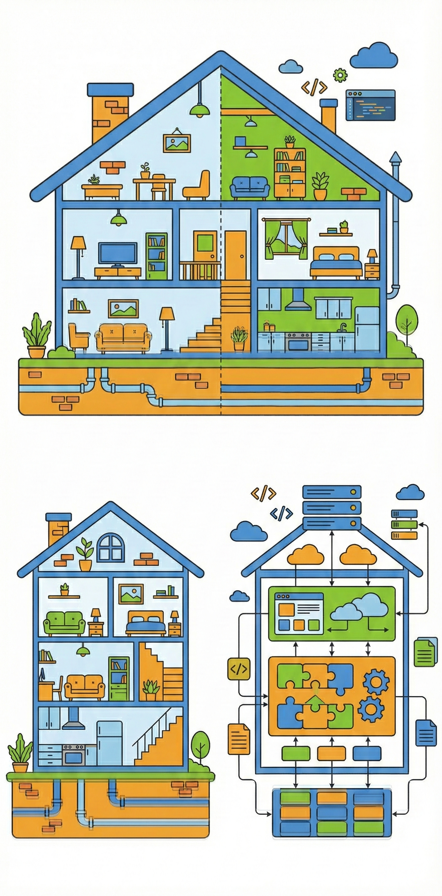
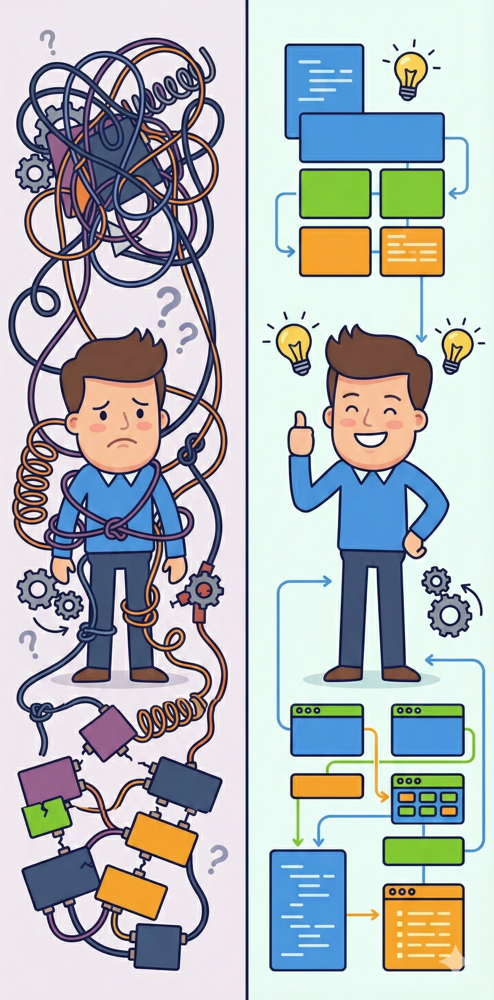

# アーキテクチャって何？
## ぐちゃぐちゃコードから卒業しよう


---

## 今日持って帰ってほしいこと

- アーキテクチャ = コードの整理術
- ぐちゃぐちゃコードがなぜヤバいのか
- 基本の整理パターン2つ
- **明日からできる小さな一歩**

---

## アーキテクチャって？



**ひとことで言うと「コードの整理術」**

家を建てるときに設計図が必要なのと同じ
コードも「どこに何を置くか」を考えないと...

→ **後でめちゃくちゃ苦労する**

---

## ぐちゃぐちゃコード あるある



### 😱 悪い設計のとき
- バグ修正に3日かかる（なぜ...）
- 新機能追加が怖すぎる
- コード読むだけで1日終わる
- 「前の人、何考えてたの...？」

### 😊 良い設計のとき
- 変更がサクッとできる
- テストも書きやすい
- 新メンバーがすぐ理解できる

---

## これがスパゲッティコード


```javascript
// 全部が一箇所に詰め込まれている...
function handleUserLogin(username, password) {
  const db = connectDB("localhost", "root", "pass");
  const user = db.query(`SELECT * FROM users WHERE name='${username}'`);
  if (user.password === password) {
    document.getElementById("message").innerText = "ログイン成功";
    localStorage.setItem("user", username);
  }
}
```

**何が問題？**
DB接続、SQL、画面操作、セッション管理...全部混ざってる！

---

## 整理するとこうなる

役割ごとに分ける = **関心の分離**

```javascript
// データベース担当
class UserRepository {
  async findByUsername(username) { /* DB処理だけ */ }
}

// ログイン処理担当
class AuthService {
  async login(username, password) { /* 認証だけ */ }
}

// 画面表示担当
class LoginController {
  async handleLogin(req, res) { /* 画面処理だけ */ }
}
```

**それぞれが自分の仕事に集中！**

---

## パターン① レイヤードアーキテクチャ
**層で分ける**


```
┌─────────────────────────┐
│  画面（UI）              │  ← ユーザーが見る部分
├─────────────────────────┤
│  ビジネスロジック        │  ← アプリの核心
├─────────────────────────┤
│  データベース            │  ← データの出し入れ
└─────────────────────────┘
```

**ポイント**: 上の層は下を使うけど、下の層は上を知らない
→ 変更の影響が限定される

---

## パターン② MVC
**役割で分ける**


```
View (画面)  ← 見た目担当
   ↑
Controller (制御) ← 司令塔
   ↑
Model (データ) ← データ管理
```

**例**: ユーザー登録機能
- Model: ユーザーデータの保存・取得
- View: 登録フォームの表示
- Controller: フォーム送信時の処理

---

## 覚えておきたい3つの呪文


### DRY (ドライ)
**Don't Repeat Yourself** = 同じコード書くな
コピペは悪！

### KISS (キス)
**Keep It Simple** = シンプルイズベスト
複雑にしすぎない

### YAGNI (ヤグニ)
**You Aren't Gonna Need It** = 今いらないものは作るな
未来のことは未来で考える

---

## 完璧主義は捨てよう


❌ 最初から完璧な設計を目指す
⭕ **少しずつ改善していく**

- 最初は多少ぐちゃぐちゃでもOK
- リファクタリングは怖くない
- 動くコードがまず大事

**継続的に良くしていくのがプロ**

---

## 明日からできること

### ステップ1: ファイルを分ける
`app.js` に全部書くのをやめる
→ `user.js`, `auth.js`, `database.js` みたいに

### ステップ2: フォルダで整理
```
src/
  controllers/  ← リクエスト処理
  services/     ← ビジネスロジック
  models/       ← データ
```

**これだけでも全然違う！**

---

## チーム開発では超重要


良いアーキテクチャがあると...
- 「あの人しかわからない」がなくなる
- 複数人で同時に作業できる
- レビューがしやすい
- バグが減る

**チームの生産性が段違い**

---

## 学び方のコツ

1. **有名OSSのコードを見る**
   Next.js、Express、Reactとか

2. **小さいプロジェクトで試す**
   個人開発で実験してみる

3. **失敗を恐れない**
   最初はうまくいかなくて当然

4. **チームで話し合う**
   「こう整理したほうが良くない？」

---

## まとめ


✅ アーキテクチャ = コードの整理術
✅ ぐちゃぐちゃだと後で絶対困る
✅ レイヤードとMVCを知っておこう
✅ 完璧じゃなくてOK、改善し続けよう

**まずはファイル分けから始めよう！**

---

## 参考になる本

気になったら読んでみて

- 『リーダブルコード』← 超おすすめ
- 『Clean Architecture』← ちょっと難しいけど名著
- 『現場で役立つシステム設計の原則』← 実践的

---

## おわり！

質問あればどうぞ

**みんなのコードが少しでもキレイになりますように**
