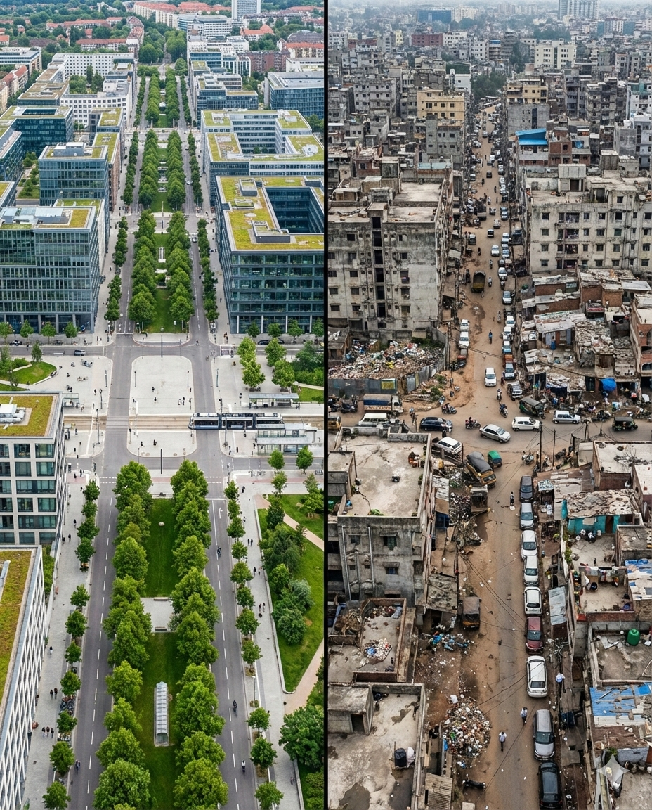
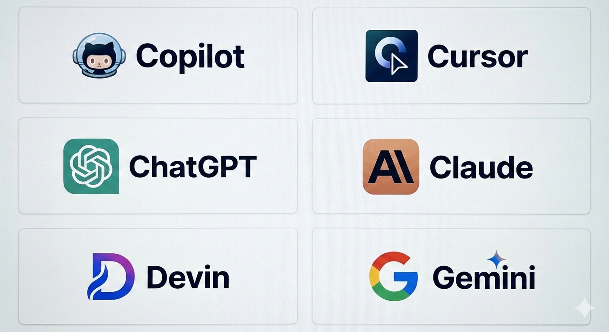
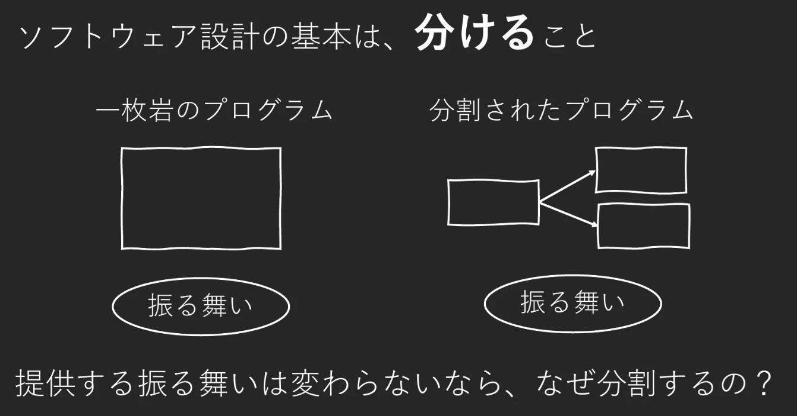

<!-- _class: title -->



# 良い設計とは

---

## なぜ今、このテーマなのか？ 🤖

**AIがコードを書く時代が来ている**



---

## では、エンジニアに求められるものは？ 🎓

- AIの力を引き出す指示能力
- AIの出力を評価・判断する能力

**👉「良い設計」の理解が必須**

---

## 理想のシステム像 🎯

1. ビジネス要求を満たせる
2. 変更しやすい
3. チームで開発できる

**👉これらを実現するのが「設計」**

---

## 設計原理：CLEAN 💡

<div class="clean-grid">

<div class="clean-item">
<span class="clean-letter">C</span>
<strong>Cohesive（高凝集）</strong>
<small>単一責任原則 (SRP)</small>
</div>

<div class="clean-item">
<span class="clean-letter">L</span>
<strong>Loosely Coupled（疎結合）</strong>
<small>インターフェース分離原則 (ISP)</small>
</div>

<div class="clean-item">
<span class="clean-letter">E</span>
<strong>Encapsulated（カプセル化）</strong>
<small>オープン・クローズドの原則 (OCP)、依存性逆転原則 (DIP)</small>
</div>

<div class="clean-item">
<span class="clean-letter">A</span>
<strong>Assertive（関心の分離）</strong>
<small>単一責任原則 (SRP)、インターフェース分離原則 (ISP)</small>
</div>

<div class="clean-item">
<span class="clean-letter">N</span>
<strong>Nonredundant（非冗長）</strong>
<small>DRY原則、YAGNI原則</small>
</div>

</div>

<div class="small">

出典: 『レガシーコードからの脱却』David Scott Bernstein 著

</div>

**今日は「関心の分離（A）」を深掘りします**

---

## ソフトウェア設計の基本 🔧



---

## なぜ分けるのか？ 💡

分割によって得られるもの

✅ わかりやすい

✅ テストしやすい

✅ 拡張しやすい

✅ 再利用しやすい

**分割することで、振る舞い以上の力を得る**

---

## 良くないコードの例（C#） 🤖

```csharp
// ユーザー登録機能の実装例
public class UserController : Controller {
  public IActionResult Register(string email, string password, string name) {
    // バリデーション
    if (string.IsNullOrEmpty(email) || !email.Contains("@"))
      return View("Error");

    // DB接続
    var conn = new SqlConnection("Server=localhost;...");
    conn.Open();

    // 重複チェック（SQLインジェクション脆弱性あり）
    var cmd = new SqlCommand($"SELECT COUNT(*) FROM Users WHERE Email='{email}'", conn);
    if ((int)cmd.ExecuteScalar() > 0) return View("Error");

    // パスワードハッシュ化＋ユーザー登録
    var hashed = BCrypt.HashPassword(password);
    new SqlCommand($"INSERT INTO Users VALUES ('{email}', '{hashed}', '{name}')", conn).ExecuteNonQuery();

    // ウェルカムメール＋Slack通知
    new SmtpClient("smtp.example.com").Send(new MailMessage("no-reply", email, "登録完了"));
    new WebClient().UploadString("https://hooks.slack.com/...", $"新規: {email}");

    conn.Close();
    return RedirectToAction("Index");
  }
}
```

**あなたは、このコードをマージしますか？**

---

## 何が問題か？ 🔍

このコードには **5つの異なる関心** が混在している

1. ✅ **バリデーション**
2. 🗄️ **データベース接続・操作**
3. 🔐 **ビジネスロジック**（重複チェック・パスワードハッシュ化）
4. 📧 **メール送信**
5. 📢 **Slack通知**

---

## 関心が分離されていないと... 💥

❌ **チームで開発できない**
作業分担が困難、コンフリクト頻発

❌ **変更が怖い**
影響範囲が予測できない

❌ **開発速度が落ちる**
小さな修正にも大きなコスト

**→ 開発者の認知負荷が高い 🤯**

---

## リファクタリング例①：関心の分離 ✨

```csharp
// データベース操作の関心
public class UserRepository {
  public bool EmailExists(string email) { /* DB操作のみ */ }
  public void CreateUser(User user) { /* DB操作のみ */ }
}

// バリデーションの関心
public class UserValidator {
  public ValidationResult Validate(UserInput input) { /* 検証のみ */ }
}

// メール送信の関心
public class EmailService {
  public void SendWelcomeEmail(string email) { /* メール送信のみ */ }
}

// 通知の関心
public class NotificationService {
  public void NotifyRegistration(string email) { /* 通知のみ */ }
}
```

---

## リファクタリング例②：サービスの組み合わせ ✨

```csharp
public class UserController : Controller
{
  private readonly UserRepository _userRepo;
  private readonly UserValidator _validator;
  private readonly EmailService _emailService;
  private readonly NotificationService _notificationService;

  public IActionResult Register(UserInput input) {
    var validationResult = _validator.Validate(input);
    if (!validationResult.IsValid) {
      ViewBag.Error = validationResult.ErrorMessage;
      return View();
    }

    if (_userRepo.EmailExists(input.Email)) {
      ViewBag.Error = "すでに登録されています";
      return View();
    }

    var user = new User(input.Email, input.Password, input.Name);
    _userRepo.CreateUser(user);
    _emailService.SendWelcomeEmail(input.Email);
    _notificationService.NotifyRegistration(input.Email);

    return RedirectToAction("Index");
  }
}
```

**変更の影響が局所化された！** ✅

---

## 明日からできること 💪

**1. 自分に問いかける習慣**
「この処理、本当にここに書くべき？」
「複数の関心ごとが混ざっていないか？」

**2. AIに問いただす**
「単一責任原則（SRP）を守ってる？」
「関心の分離できてる？」
→ CLEAN・SOLIDの原則名を使って確認

---

## もっと深く学ぶには 📚

### 超推奨 ⭐⭐⭐⭐⭐

**「Architecture to Design より良い設計を目指して」**
米久保剛氏 @ Developers Summit 2025

全75ページ、CLEAN設計原理を詳しく解説
**今日の内容の100倍濃い！**

https://www.docswell.com/s/tyonekubo/5R2Y4E-architecture2design

---

## まとめ 📝

✅ **設計原理「関心の分離」を学んだ**

✅ **AI時代は評価能力が重要**

✅ **明日からコードレビューで意識しよう**

✅ **米久保氏の資料で深く学ぼう**

---

## ちなみに、この資料は... 📊

**[Marp](https://marp.app/)** でMarkdownからHTML生成
- Markdown Presentation Ecosystem
- HTML、PDF、PowerPointに出力可能

**[Claude Code](https://claude.com/claude-code)** でほぼ作成
- AIペアプログラミングツール
- プレゼンテーション構成・コード例・スタイリング

**[Gemini](https://gemini.google.com/)** で挿絵を生成
- AI画像生成ツール

**ご清聴ありがとうございました** 🙏
